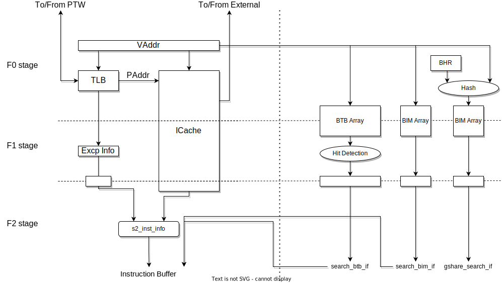

== フロントエンド

フロントエンドは、SCARIVコアにおける命令フェッチおよび命令デコードを行います。
命令フェッチにより取得された命令はデコードユニットにより命令の解釈が行われ、解釈の結果に基づいてバックエンドに渡されます。

SCARIVのフロントエンドは以下のユニットで構成されています。

命令キャッシュ::
  フェッチした命令を保持しておくキャッシュです。キャッシュのラインサイズはSCARIV外部インタフェースと同一です。
  命令キャッシュは、仮想アドレスに基づいてアドレスを格納しています。
命令TLB::
  命令フェッチ用の仮想アドレスを物理アドレスに変換します。構成はデータTLB(後述)と同一です。
命令バッファ::
  命令キャッシュから取得した命令を一時的に格納しておくバッファです。

=== 各ステージの機能

SCARIVのフロントエンドは以下のステージで構成されています。図に各ステージの流れを示します。

F0ステージ::
  命令キャッシュおよびTLBに対して仮想アドレスのリクエストを送出します。
  TLBは同じサイクルで物理アドレスの探索結果を返します。
  ヒットすれば物理アドレスまたは例外情報、ミスすればmiss信号をアサートします。
  命令キャッシュ内では、命令タグアドレスを用いたタグRAMの検索とデータRAMの読み出しが
  行われます。
F1ステージ::
  タグRAMから読みだしたタグ情報を用いて命令キャッシュのヒット/ミスを決定します。
F2ステージ::
  F1ステージの結果、命令キャッシュがヒットしていればヒットした命令を取得します。
  そうでなければ命令キャッシュは読み出しをBusy状態に入り、外部に対して命令キャッシュリクエストを
  送出します。

=== 命令キャッシュの役割

xxx

=== 命令TLBの役割

命令TLBは命令フェッチ用の仮想アドレスを物理アドレスに変換する機能を持ちます。
TLBはヒット時は0サイクルで変換を行いますが、ミスの場合はmiss信号をアサートし
PTW要求を外部に送出します。

=== 分岐予測

SCARIVが搭載している分岐予測器については、xxxで解説します。

=== 命令バッファの役割

命令バッファはF2ステージで取得した命令キャッシュの内容を確保し、
一時的に保管する役割を持っています。
バックエンドのリソース状態を確認しながら、命令を取り出して
_ディスパッチ(dispatch)_ を行います。

命令バッファの先頭から命令を取り出す際、バックエンドのリソース量に応じて
ディスパッチする命令を決定しています。
バックエンドはフロントエンドから同時に受け取ることができる命令の数が決められており、
その情報に基づいてディスパッチする命令を決定します。

例えば、バックエンドにおいてALU命令を同時に2つ、LSU命令を同時に2つ受け取ることができる場合、
命令バッファの先頭から、これらの制約を満たす量の命令を取り出してディスパッチします。

=== 命令の分配

SCARIVでは各命令は命令の種類に応じて異なるバックエンド実行ユニットに渡されます。
1サイクルで命令発行可能な命令数が決まっており、`scariv_conf_pkg::DISP_SIZE`
によって定義されています。

さらでコア内でバックエンドの実行ユニットが何個インスタンス化されているかに応じてそれぞれの実行ユニットに対して発行命令数が決められます。
算術演算命令は [.title-ref]#scariv_conf_pkg::ALU_DISP_SIZE#
によってALU命令の発行可能な命令数が定義されています。 また、同様に
[.title-ref]#scariv_conf_pkg:ALU_INST_NUM#
によりコア内に何個のALU実行ユニットがインスタンス化されるかも決められています。
従って、 [.title-ref]#ALU_DISP_SIZE / ALU_INST_NUM#
は整数でなければなりません。

ALU実行ユニットはそれぞれ [.title-ref]#ALU_DISP_SIZE / ALU_INST_NUM#
の命令数だけフロントエンドから命令を受け取ることができます。

メモリアクセス命令は、ロード命令とストア命令で1サイクル当たり発行可能な命令数が決めれており、
それぞれ [.title-ref]#scariv_conf_pkg::MEM_DISP_SIZE#
で定義した命令数分の命令を受け取ることができます。 また、LSUは内部に
[.title-ref]#scariv_conf_pkg::LSU_INST_NUM#
で定義される数だけLSUアクセス実行ユニットをインスタンス化することができます。

FPU命令もALU命令と同様に、 [.title-ref]#FPU_DISP_SIZE#
によって定義された命令数だけ命令を同時に発行することができ、 また
[.title-ref]#FPU_INST_NUM#
に定義された数だけFPU実行ユニットがインスタンス化されています。
従って、`FPU_DISP_SIZE / FPU_INST_NUM` は整数でなければならず、
FPU実行ユニットはそれぞれ [.title-ref]#FPU_DISP_SIZE / FPU_INST_NUM#
の命令数だけフロントエンドから命令を受け取ることができます。

==== ALU/FPU命令の分配方法

ALU実行ユニットとFPU実行ユニットにコア内に複数個インスタンスし同時に実行することができます。
命令がどの実行ユニットに発行されるかは、命令発行時に決定されます。 ALUが
[.title-ref]#n# 個インスタンスされる場合、それぞれの実行ユニットをALU0,
ALU1, ... ALUn-1とすると、
算術演算命令は、命令グループ内の若い順番にALU0, ALU1
の順番に発行されます。これにより、命令発行が特定のALUに偏ることを防ぎます。

FPUも同様の方式により発行されます。

図xxxに、ALUの最大同時発行命令数 [.title-ref]#ALU_DISP_SIZE=8#,
ALU実行ユニット数 [.title-ref]#ALU_INST_NUM=4#
の場合にALU命令の配分を示します。

.ALUの最大同時発行命令数 [.title-ref]#ALU_DISP_SIZE=8#,
ALU実行ユニット数 [.title-ref]#ALU_INST_NUM=4#
の場合にALU命令の発行実行ユニット
[width="99%",cols="28%,9%,9%,9%,9%,9%,9%,9%,9%",options="header",]
|===
| |Inst0 |Inst1 |Inst2 |Inst3 |Inst4 |Inst5 |Inst6 |Inst7
|命令 |[.title-ref]#ADDI# |[.title-ref]#SUB# |[.title-ref]#ADD#
|[.title-ref]#LD# |[.title-ref]#ADD# |[.title-ref]#MUL#
|[.title-ref]#ST# |[.title-ref]#ADD#

|命令タイプ |ALU |ALU |ALU |LOAD |ALU |ALU |STORE |ALU

|ALU発行実行ユニット |ALU0 |ALU1 |ALU2 | |ALU3 |ALU0 | |ALU1
|===

==== LSU命令の分配方法

LSU命令は、命令発行時にロード命令・ストア命令の種類によってLDQ,
STQに発行されるかが決定されますが、
どのLSU実行ユニットを使用して実行されるかについても命令発行時に決定されます。
LSU実行ユニットが [.title-ref]#n#
個インスタンスされる場合、それぞれの実行ユニットをLSU0, LSU1, ...
LSUn-1とすると、 命令発行時に、命令グループ内の若い順番にLSU0, LSU1
の順番に発行されます。これにより、命令発行が特定のLSU実行ユニットに偏ることを防ぎます。

表xxxに、LSUの最大同時発行命令数 [.title-ref]#MEM_DISP_SIZE=8#,
LSU実行ユニット [.title-ref]#LSU_INST_NUM=3#
の場合のロードストア命令の割り当てを示します。

.LSUの最大同時発行命令数 [.title-ref]#MEM_DISP_SIZE=8#,
LSU実行ユニット数 [.title-ref]#LSU_INST_NUM=4#
の場合にLSU命令の発行される実行ユニット
[width="99%",cols="28%,9%,9%,9%,9%,9%,9%,9%,9%",options="header",]
|===
| |Inst0 |Inst1 |Inst2 |Inst3 |Inst4 |Inst5 |Inst6 |Inst7
|命令 |[.title-ref]#LD# |[.title-ref]#ST# |[.title-ref]#LD#
|[.title-ref]#LD# |[.title-ref]#ST# |[.title-ref]#ST# |[.title-ref]#LD#
|[.title-ref]#LD#

|命令タイプ |LOAD |STORE |LOAD |LOAD |STORE |STORE |LOAD |LOAD

|LSU発行実行ユニット |LSU0 |LSU1 |LSU2 |LSU0 |LSU1 |LSU2 |LSU3 |LSU0
|===

=== [.title-ref]#FENCE.I# 命令に対する動作

[.title-ref]#FENCE.I#
命令はRISC-Vにおける命令キャッシュとメモリアクセスデータの整合性を取るための命令です。
[.title-ref]#FENCE.I#
命令を実行すると、命令側とデータ側のポートが同期され、命令フェッチ側でデータキャッシュ側の
アップデートが観察できるようになります。

SCARIVでは、 [.title-ref]#FENCE.I#
命令はCSU命令としてカテゴライズされており、投機実行は行われません。
[.title-ref]#FENCE.I#
命令が実行されると、命令キャッシュのタグがすべてクリアされ、命令キャッシュの内容は
破棄されます。

==== 命令のプリフェッチ

SCARIVにはシンプルな命令プリフェッチ機能が搭載されています。
命令プリフェッチは、ある物理アドレスに対してキャッシュミスが発生した場合、そのキャッシュラインのL2へのフェッチの直後に、
命令プリフェッチャーがそれを検出し次のキャッシュラインをプリフェッチします。

プリフェッチャーが取得した命令ブロックは命令キャッシュに書き込まれることなく、
命令フェッチリクエストを監視しヒットするかをチェックします。
命令フェッチアドレスとヒットした場合には、命令を供給するとともに命令キャッシュに当該ブロックを書き戻します。
