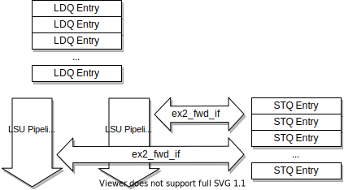
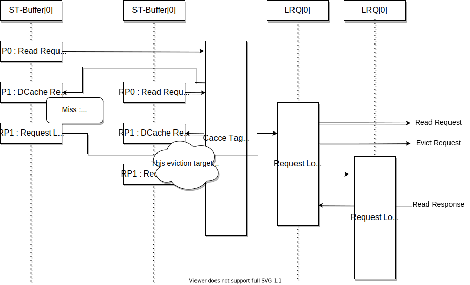

== メモリアクセス

=== LSUの構成

図 <<scariv_lsu_top>> に、SCARIV LSUのモジュール構成を示します。

[[scariv_lsu_top]]
.SCARIV LSUモジュールの構成

=== SCARIVのメモリアクセスの実装

SCARIVはメモリアクセスのために2つのキューを使って命令の生存管理をしています。

また、SCARIVのLSUは大きく分けて以下のユニットで構成されています。
それぞれの役割について詳細を以下で説明します。

Scheduler::
命令スケジューラです。ディスパッチされた命令はここに格納されます。

Load Queue(LDQ)::
ロード命令に関する管理を行います。ディスパッチされたロード命令はスケジューラとともにLDQにも格納されます。

Store Queue(STQ)::
ストア命令に関する管理を行います。また、アトミック命令もこのキューを用いて管理を行います。
ディスパッチされたストア命令・アトミックアクセス命令はスケジューラとともにSTQにも格納されます。

Miss Status Handling Registers(MSHR)::
キャッシュブロックを外部から取得するためのコントローラです。 

Store Buffer::
コミット後のストア命令のデータを一時的に格納し、L1Dキャッシュに書き込むまで待機するためのバッファです。

Store Requester::
キャッシュブロックを外部に出力するためのコントローラです。

Replay Queue::
ハザードの発生した命令を格納し、リプレイを行うためのキューです。

DCache::
L1データキャッシュです。

SnoopUnit::
外部からのキャッシュブロック取得を管理するためのコントローラです。

=== メモリアクセスパイプライン

スケジューラ内の命令は、必要なオペランドがすべて揃うとLSUパイプラインに挿入されます。
命令発行はメモリアドレス生成に必要なオペランドが命令発行条件となり、ストア命令のストアデータはLSUパイプラインへの発行条件には含まれません
(メモリアドレスの生成とは別に、ストアデータまで揃った時点でストア命令は命令実行完了状態となり、コミットを待ちます)。

LSUパイプラインはEX0からEX3までのステージで構成されています。

* ロード命令:
** EX0:
命令の詳細デコードを行います。
メモリアクセスアドレスを生成し、TLBへアクセスします。TLBヒットの場合、物理アドレスを取得します
** EX1:
EX0で取得した物理アドレスを使用してL1Dキャッシュへアクセスします。
各種ユニットに対して、フォワーディング及びハザードの検索を行います。
** EX2:
EX1でのL1Dキャッシュアクセスの結果、ヒットの場合はL1Dからデータを取得します
** EX3: 実行を終了し、パイプラインを完了します

* ストア命令:
** EX0:
メモリアクセスアドレスを生成し、TLBへアクセスします。TLBヒットの場合、物理アドレスを取得します
** EX1: 何もしません
** EX2: 何もしません
** EX3: 実行を終了し、パイプラインを完了します

このとき、各ステージで発生する可能性のあるハザードは以下の通りです

* EX0ステージでは、メモリアドレスを計算するだけで、ハザードは発生しません
* EX1ステージでは、TLBミスが発生するとハザードが通知され、リプレイキューに挿入されます。
TLBミスが解消されると、リプレイキュー内の命令は再発行されます。
* EX1ステージでは、TLBの結果により例外が発生する可能性があります。
LDQエントリは例外の発生を受け取ると、実行を完了しROBに命令実行完了と例外を通知します。
* EX2ステージでは、STQとのフォワーディングチェックを行います。
詳細は"LDQ / STQ間のハザード管理"で説明します。
* EX1ステージでは、L1Dキャッシュのアクセスを行い、その結果はEX2で通知されます。
ロード命令かつL1Dキャッシュミスの場合、EX3ステージでMSHRにロード通知が行われます。
L1Dキャッシュミスはリプレイキューに通知され、MSHRによりロードが完了するまで待ち合わせ状態に入ります。
L1Dキャッシュミスが解消されると、リプレイキューからパイプラインへ再度投入されます。

=== LDQ

LDQはロード命令に関する管理を行います。フロントエンドから発行されたロード命令はまずLDQに格納されます。
主に、ストア命令によるメモリ順序違反の検出を行うために、各ロード命令のアクセスしたアドレスを記憶しています。

=== ストアバッファ

コミットされたストア命令はデータをL1Dに書き込みますが、その前にアドレスとデータの情報はストアバッファに移されます。
ストアバッファはコミットされたストア命令が、L1Dキャッシュに書き込まれるまでの状態を管理します。
ストアバッファは `XLEN * 2` ビット幅のデータを管理することができ、隣接する複数のデータを管理することができます。

コミット処理により複数のストア命令がコミット状態になった時、コミット対象の先頭となる命令に対して、
連続する後続のコミット状態の命令も同じストアバッファの管理アドレス範囲に存在している場合、
その複数の命令はマージされてストアバッファに格納されます。

* ストア対象となるアドレスがL1Dに存在しているかどうかをチェックする
** 存在する場合はL1Dに書き込みを行う
** 存在していない場合はMSHRに対して当該キャッシュラインのロード要求を行う
* ストアバッファは後続のコミット済みストア命令が同じキャッシュラインに書き込みを行う場合、それを検出してマージを行います。
** マージされたデータは、一緒にL1Dに書き込まれます。

ストアバッファは複数のエントリを持ち、それぞれのエントリは以下のように動作します。

[arabic]
. サイクル1.
L1Dキャッシュに対して当該物理アドレスの読み込み処理を行う。2. へ移動する
. サイクル2. L1Dキャッシュに存在していれば(Hit)、3.
へ移動する。そうでなければ4.へ移動する
. サイクル3. L1Dキャッシュへの書き込みを行う。処理を終了する
. サイクル3. L1Dキャッシュに存在していない場合、MSHRにフィル要求を発行する。5. へ移動する
. サイクルN. MSHRからデータのロード通知を受けると、L1Dキャッシュに対してロードデータのマージリクエストを通知する。処理を終了する

=== LDQ / STQ間のハザード管理

LDQ/STQはそれぞれプログラム順に関係なく、オペランドのそろったものから順にパイプラインに投入されます。
このためLDQ/STQはお互いにハザードを発生させる可能性があります。ハザードの要因は、以下のようなものです。

* STQ内のストア命令が実行されるよりも早く、同じアドレスを参照する若いロード命令が実行される

このハザードを検出するために、ロード命令はLSUパイプラインを通過する際に、
常にSTQの全エントリに対して"フォワーディングチェック"が行われます。

STQのエントリについて、以下の条件がすべて満たされる場合、STQからのデータがLSUパイプライン中のロード命令にフォワードされます。

* STQのエントリがロード命令よりも古い
* STQエントリのアドレスが確定しており、ロード命令のアドレスと被っている
* STQエントリのストアデータが確定している

この場合、LSUパイプライン中のロード命令はフォワーディングデータを受け取り、実行が継続されます。

一方で、以下の場合はLDQ→STQでのハザードが発生します。

* STQのエントリがロード命令より古い、かつ
* STQエントリのアドレスが確定していない、または
* STQエントリのアドレスが確定しておりロード命令のアドレスと被っているが、ストアデータが確定していない

この場合LSUパイプライン内のロード命令にはハザードが通知され、
ロード命令はLDQに戻って再開を待ちます。 STQからLDQへ、
`resolve`
信号が渡されており、どのエントリが解決したかをLDQに
常に伝えています。この信号に基づいて、ハザードが発生しているエントリの全てが解消された場合、
当該ロード命令はLDQからLSUパイプラインに再投入されます。

==== STQからロードデータフォワーディング機構

LSUパイプラインを実行中のロード命令よりも若く、なおかつ物理アドレスとストアデータの確定したストア命令がSTQ内に存在している場合、これはロード命令に対するフォワーディング対象となります。
ストア命令とロード命令の物理アドレスの範囲が一致している場合、STQからロード命令のパイプラインにデータのフォワードが行われます。

STQからLDQへのフォワーディングは、EX2ステージで各LSUパイプラインからSTQエントリに対して探索信号が送られます。
探索のために以下の情報が送られます。 

* `cmt_id` : ロード命令のコミットID
* `grp_id` : ロード命令のグループID
* `paddr` : ロード命令の物理アドレス
* `paddr_dw` : ロード命令の物理アドレスのバイト位置

バイト位置というのは、フォワーディングの探索対象となるXLENビットのデータのうち、どの位置のビットを探索するのかを示しています。
例えば、アドレス0x02に対してLoad Halfwordを実行する場合は `paddr_dw[7:0]` は以下のように設定されます。

この情報に対して、STQの各エントリは自身の物理アドレスをチェックし、アドレスが一致するかをチェックします。
この時、STQが取り扱っているデータのサイズを考慮しながらフォワーディングを考慮する必要があります。
また、STQ内で複数のアドレスが一致した場合には、より若い命令のデータを取得します。

最終的にフォワーディング情報は、下位の `log2(XLEN/8)` ビットがアラインされた状態で情報が返されます。 その様子を `stq_ld_forward_dw` に示します。
各エントリでの探索結果をバイト単位で表現し、ヒットしたビットのデータをフォワードします。

=== L1Dデータの掃き出し

L1Dデータの掃き出し(eviction)は、以下の条件で実行されます。 

1. ロード命令パイプライン実行中にL1Dキャッシュを確認した際、L1Dミス発生かつ当該キャッシュラインに空きがない場合
2. ストア命令が完了後にL1Dキャッシュに書き込む際、L1Dミス発生かつ当該キャッシュラインに空きがない場合

掃き出し行うキャッシュラインの管理は、MSHR内で行われます。 

1. の場合、L1DキャッシュリクエストがMSHR内のエントリに格納されると同時に、同じエントリに掃き出し対象のキャッシュラインの情報が格納されます。
このとき、L1Dキャッシュのタグ情報は更新されないため、MSHR内のエントリは、そのエントリが有効である間、LSUパイプラインを監視し、
同じアドレス範囲のメモリアクセスが発生するとハザードを通知し、MSHRの処理とL1Dキャッシュの完全な入れ替えが完了するまでは
当該後続命令の再実行を禁止します。 
2. の場合、ストア命令のコミット終了後にL1Dキャッシュラインの存在確認が行われ、もし2. の条件を満たした場合は掃き出し対象のキャッシュラインがMSHRに取得されます。

MSHRはミスを発生したキャッシュラインを取得するためにCPU外部にリードリクエストを送出しますが、同時に掃き出し対象のキャッシュラインもCPU外部にライトリクエストで放出します。

"同じアドレス範囲のメモリアクセスが発生すると完全な入れ替えが完了するまでは当該命令の再実行を禁止する"理由は、L1Dキャッシュのタグ情報は置き換え対象となるキャッシュラインの情報にまだ置き換わっていないため、もし後続の命令が吐き出されるキャッシュラインに対して書き込みを行っても、すでにキャッシュラインがCPU外部に吐き出されてしまっているためです。

image::cache_replace_pipeline.svg[L1Dキャッシュキャッシュライン置き換えの流れ。]

=== より詳細なL1Dのデータ交換アルゴリズム

L1Dのデータ交換はタイミング的に難しいところであるため慎重に設計する必要があります。

ここでは新たに外部から要求する物理アドレスをA、置き換え対象となるL1Dにすでに配置されている物理アドレスをBとします。

パイプライン側からのロードリクエスト::
L1Dへの物理アドレスAの要求に従い置き換え対象となる物理アドレスB、データ、当該Way番号を取得します。
このWay番号がMSHRを経由して新たに書き込まれるWayになります。
ストアバッファからのロードリクエスト::
ストアバッファはコミット済みのデータを受け取ると以下のように動作します。

[arabic]
サイクル1:: L1Dに対して当該アドレスのリードリクエストを送出する
サイクル2:: L1Dからヒット・ミス情報を取得する。ミスの場合には置き換え対象として掃き出し用の物理アドレス・データ・置き換え対象Wayを取得する
サイクル3:: MSHRにデータを渡す。この時にMSHR内のエントリとして同じ掃き出しアドレスを持っている場合、2回同じL1Dラインのデータが吐き出される可能性がある

当該キャッシュラインに新しいデータがまだ入っておらず、結果として掃き出し用のデータが古い可能性がある
このため、同じ掃き出し対象のデータをMSHR内でで見つけた場合は処理を取りやめ、MSHRの解決を待って再度L1Dのデータ取得からやり直す

=== キャッシュスヌープコントローラ

マルチコア構成などにおいて、コア間キャッシュの授受を行うためのキャッシュスヌープコントローラが搭載されています。
SCARIVのシミュレーションモデルでは、仮想L2キャッシュがL2キャッシュのラインの状態を管理しており、L1Dキャッシュからのライン取得リクエストを記憶しています。
当該領域に他のコアまたはポート(同一コアからのリクエストであっても、命令キャッシュポートやPTWポートからのリクエストの場合)からのリクエストを受け取った場合、L2コントローラはスヌープポートに対してスヌープリクエストを送出し、コアに対してキャッシュの領域確認を行います。

==== キャッシュスヌープコントローラの実装

キャッシュスヌープコントローラはコアに1つ実装されており、外部からスヌープリクエストを受け取ると、コア内部のモジュールにスヌープリクエストを発出します。

L1Dキャッシュ::
  L1Dキャッシュ内に当該アドレスのデータが保持されているかどうかを確認します。
  L1Dの読み出しポートを使用しますが、他のモジュールからの読み出しリクエストによっては
  数サイクル必要な可能性があります。最短1サイクルで情報を取得します。

STQ::
  ストアリクエストの中でコミット後のデータはスヌープの対象となります。
  コミット後のデータに対してスヌープを行い、当該データがヒットした場合はデータを返します。

キャッシュスヌープコントローラはL1DおよびSTQからの結果を取得すると、L2キャッシュに結果を返します。
コア内にデータを見つけると、バイトイネーブルをつけてその情報を返します。

image::snoop_if.svg[スヌープインタフェースの接続図。L1DキャッシュおよびSTQに接続されている。]
