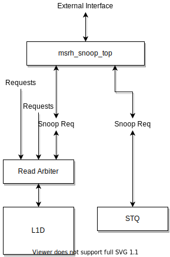

メモリアクセス
==============

MSRHのメモリアクセスの実装
--------------------------

MSRHはメモリアクセスのために2つのキューを使って命令の生存管理をしています。

また、MSRHのLSUは大きく分けて以下のユニットで構成されています。
それぞれの役割について詳細を以下で説明します。

*Load Queue(LDQ)* ロード命令に関する管理を行います
*Store Queue(STQ)* ストア命令に関する管理を行います。また、アトミック命令もこのキューを用いて管理を行います。
*Load Requestor Queue(LRQ)* キャッシュブロックを外部から取得するためのコントローラです。
*Store Requester* キャッシュブロックを外部に出力するためのコントローラです。
*DCache* L1データキャッシュです。
*SnoopUnit* 外部からのキャッシュブロック取得を管理するためのコントローラです。

メモリアクセスパイプライン
--------------------------

LDQ / STQの命令は、必要なオペランドがすべて揃うとLSUパイプラインに挿入されます。
ここで、LDQ/STQはメモリアドレス生成に必要なオペランドが命令発行条件となり、ストア命令のストアデータは
LSUパイプラインへの発行条件には含まれません(メモリアドレスの生成とは別に、ストアデータまで揃った時点で
ストア命令は命令実行完了状態となり、コミットを待ちます)。

LSUパイプラインはEX0からEX3までのステージで構成されています。

- ロード命令:

  - EX0: メモリアクセスアドレスを生成し、TLBへアクセスします。TLBヒットの場合、物理アドレスを取得します
  - EX1: EX0で取得した物理アドレスを使用してL1Dキャッシュへアクセスします。また、STQに対してフォワーディングをデータを要求します
  - EX2: EX1でのL1Dキャッシュアクセスの結果、ヒットの場合はL1Dからデータを取得します
  - EX3: 実行を終了し、パイプラインを完了します
- ストア命令:

  - EX0: メモリアクセスアドレスを生成し、TLBへアクセスします。TLBヒットの場合、物理アドレスを取得します
  - EX1: 何もしません [#store_pipe]_
  - EX2: 何もしません [#store_pipe]_
  - EX3: 実行を終了し、パイプラインを完了します

このとき、各ステージで発生する可能性のあるハザードは以下の通りです

- EX0ステージでは、メモリアドレスを計算するだけで、ハザードは発生しません
- EX1ステージでは、TLBミスが発生するとハザードが通知され、LDQ内のエントリは待ち合わせ状態に入ります。
  TLBミスが解消されると、LDQ/STQからパイプラインへ再度投入されます。
- EX1ステージでは、TLBの結果により例外が発生する可能性があります。
  LDQエントリは例外の発生を受け取ると、実行を完了しROBに命令実行完了と例外を通知します。
- EX2ステージでは、STQとのフォワーディングチェックを行います。
  詳細は"LDQ / STQ間のハザード管理"で説明します
- EX1ステージでは、L1Dキャッシュのアクセスを行い、その結果はEX2で通知されます。
  ロード命令かつL1Dキャッシュミスの場合、EX3ステージでLoad Requseterにロード通知が行われます。
  L1DキャッシュミスはLDQに通知され、Load Requsterによりロードが完了するまで待ち合わせ状態に入ります。
  L1Dキャッシュミスが解消されると、LDQからパイプラインへ再度投入されます。

LDQエントリのステートマシン
---------------------------

LDQエントリはロード命令の管理を行います。LDQは複数のLDQエントリを持っており、
1つのエントリが1つのロード命令を管理しています。それぞれのエントリはステートマシンを持っており、
ロード命令の動作を管理しています。

STQエントリのステートマシン
---------------------------

STQエントリはストア命令の管理を行います。STQは複数のSTQエントリを持っており、
1つのエントリが1つのストア命令を管理しています。それぞれのエントリはステートマシンを持っており、
ストア命令の動作を管理しています。

LDQ / STQ間のハザード管理
-------------------------

LDQ/STQはそれぞれプログラム順に関係なく、オペランドのそろったものから順にパイプラインに投入されます。
このためLDQ/STQはお互いにハザードを発生させる可能性があります。ハザードの要因は、以下のようなものです。

- STQ内のストア命令が実行されるよりも早く、同じアドレスを参照する若いロード命令が実行される

このハザードを検出するために、ロード命令はLSUパイプラインを通過する際に、
常にSTQの全エントリに対して"フォワーディングチェック"が行われます。

STQのエントリについて、以下の条件がすべて満たされる場合、STQからのデータがLSUパイプライン中のロード命令にフォワードされます。

- STQのエントリがロード命令よりも古い
- STQエントリのアドレスが確定しており、ロード命令のアドレスと被っている
- STQエントリのストアデータが確定している

この場合、LSUパイプライン中のロード命令はフォワーディングデータを受け取り、実行が継続されます。

一方で、以下の場合はLDQ→STQでのハザードが発生します。

- STQのエントリがロード命令より古い、かつ
- STQエントリのアドレスが確定していない、または
- STQエントリのアドレスが確定しておりロード命令のアドレスと被っているが、ストアデータが確定していない

この場合LSUパイプライン内のロード命令にはハザードが通知され、
ロード命令はLDQに戻って再開を待ちます。
STQからLDQへ、 `resolve` 信号が渡されており、どのエントリが解決したかをLDQに
常に伝えています。この信号に基づいて、ハザードが発生しているエントリの全てが解消された場合、
当該ロード命令はLDQからLSUパイプラインに再投入されます。

L1Dデータの掃き出し
-------------------

L1Dデータの掃き出し(eviction)は、以下の条件で実行されます。
1. ロード命令パイプライン実行中にL1Dキャッシュを確認した際、L1Dミス発生かつ当該キャッシュラインに空きがない場合
2. ストア命令が完了後にL1Dキャッシュに書き込む際、L1Dミス発生かつ当該キャッシュラインに空きがない場合

掃き出し行うキャッシュラインの管理は、LRQ内で行われます。
1. の場合、L1DキャッシュリクエストがLRQ内のエントリに格納されると同時に、同じエントリに掃き出し対象のキャッシュラインの情報が格納されます。
2. の場合、ストア命令のコミット終了後にL1Dキャッシュラインの存在確認が行われ、掃き出し対象のキャッシュラインが取得されます。
LRQに書き込み対象のキャッシュラインの取得要求が送出され、同時に同じエントリに掃き出し対象のキャッシュラインが格納されます。

.. figure:: cache_replace_pipeline.svg
   :alt: キャッシュ掃き出し動作の概要
   :align: center

   データキャッシュ キャッシュライン置き換えの流れ。

キャッシュスヌープコントローラ
------------------------------

マルチコア構成などにおいて、コア間キャッシュの授受を行うためのキャッシュスヌープコントローラが
搭載されています。
MSRHのシミュレーションモデルでは、仮想L2キャッシュがL2キャッシュのラインの状態を管理しており、
L1Dキャッシュからのライン取得リクエストを記憶しています。
当該領域に他のコアまたはポート(同一コアからのリクエストであっても、
命令キャッシュポートやPTWポートからのリクエストの場合)からのリクエストを受け取った場合、
L2コントローラはスヌープポートに対してスヌープリクエストを送出し、
コアに対してキャッシュの領域確認を行います。

キャッシュスヌープコントローラの実装
^^^^^^^^^^^^^^^^^^^^^^^^^^^^^^^^^^^^

キャッシュスヌープコントローラはコアに1つ実装されており、外部からスヌープリクエストを受け取ると、
コア内部のモジュールにスヌープリクエストを発出します。

:L1Dキャッシュ: L1Dキャッシュ内に当該アドレスのデータが保持されているかどうかを確認します。
                L1Dの読み出しポートを使用しますが、他のモジュールからの読み出しリクエストによっては
                数サイクル必要な可能性があります。最短1サイクルで情報を取得します。
:STQ: ストアリクエストの中でコミット後のデータはスヌープの対象となります。
      コミット後のデータに対してスヌープを行い、当該データがヒットした場合はデータを返します。

キャッシュスヌープコントローラはL1DおよびSTQからの結果を取得すると、L2キャッシュに結果を返します。
コア内にデータを見つけると、バイトイネーブルをつけてその情報を返します。

   スヌープインタフェースの接続図。L1DキャッシュおよびSTQに接続されている。
