== SCARIV RISC-V CPUコア外観

SCARIVはRISC-V互換のアウトオブオーダ実行可能なCPUです。

以下のRISC-V命令セットをサポートしています。

* RISC-V RV32 / RV64の両方をサポート
** RV32IMABFDC_Zicond (RV32IMAFDC)をサポート
** RV64IMABFDC_Zicond (RV64IMAFDC)をサポート
* アウトオブオーダ実行可能なパイプライン

実装の特徴は以下の通りです。

* SystemVerilog記述
* パラメタライズされた柔軟なコア構成
** コア内の多くのパラメータが変更可能で、面積・性能を調整した最適なコアを生成可能

=== パイプラインの概要

図 <<scariv_pipeline>> に、パイプラインの概要を示します。

:scariv_pipeline:
.SCARIV CPUコア・パイプライン全体の概略図

