[[scheduler]]
== 命令発行スケジューラ

命令発行スケジューラは、フロントエンドでデコードされた命令を一時的に格納し、バックエンドでの実行管理を行う役割を持っています。
SCARIVはコア内で命令の種類毎に異なるスケジューラを持っており、命令の種類に応じて使用されるスケジューラが異なります。

SCARIVでは、以下の命令種に応じてそれぞれスケジューラが用意されています。

* ALU
* BRU
* CSU
* LSU
* FPU

ただし、LSUのみは使用される上記の命令種で使用されるスケジューラと異なります。
LSUではロード命令とストア命令に応じて個別にスケジューラが実装されており、スケジューラの数はLSUパイプラインの数とは無関係です。

=== スケジューラの実装

スケジューラはフロントエンドからディスパッチされた命令を受け取り、バックエンドの実行パイプラインに渡すための役割を持っています。

スケジューラには、一般的に複数の"命令管理エントリ"が搭載されており、個別に命令のスケジューリングを行っています。
それぞれのエントリは、命令の順序と関係なくパイプラインに対する命令発行要求を行うことができます(アウトオブオーダ実行)。

全てのエントリが命令で埋められると、スケジューラはフロントエンドに対してこれ以上命令を受け取ることができないことを通知します。
この場合はフロントエンドが停止します。

=== 命令のパイプラインにおける早期書き込み通知とフォワーディングパス

ある命令が書き込むレジスタを後続の命令が使用する場合、命令の早期発行を可能にするために書き込みデータのフォワーディングが行われます。

この時、依存する命令の早期発行を可能にするため、書き込みデータをフォワーディングパスに渡す1サイクル前に早期書き込み通知がスケジューラに通知されます。

例えば、以下のアセンブリコードを考えます。

....
LD   x10, 8(x2)
ADD  x12, x10, x13
....

`LD` 命令はメモリからデータをロードして`x10`に書き込みを行います。
ADD命令は `LD` 命令が書き込む `x10` を読み込んで演算オペランドとして使用します。

`LD` 命令がキャッシュミスを発生しない場合、パイプラインにおけるフォワーディングの通知パスは図 <<fwd_cachehit>> 以下のように動作します。
実際にデータがフォワーディング・バスに書き込まれる1サイクル前に、 `early_wakeup` パスが通知され、これに従って依存する命令が1サイクル早く命令を発行することができます。

[[fwd_cachehit]]
.LD命令とALU間のレジスタ書き込み通知とフォワーディングパス

`early_wakeup` パスはキャッシュのヒット・ミスに関係なく通知が行われるため、キャッシュミスが発生した場合、依存関係の解決をキャンセルするための通知を行う必要があります。
このためのパイプラインの動作を <<fwd_cachemiss>> に示します。

[[fwd_cachemiss]]
.LD命令とALU間のレジスタ書き込み通知後、キャッシュミスによりレジスタ書き込みの通知をキャンセルするためのパス

